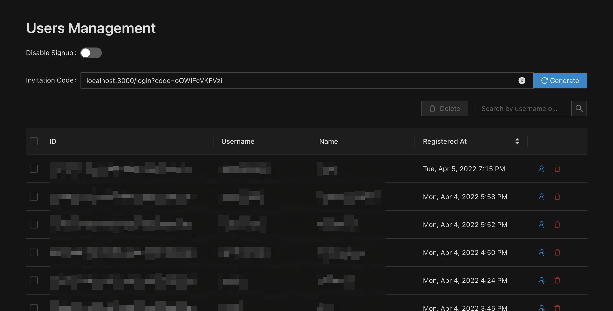

## What's New?

- Users Management (Admin Panel)



## Upgrade Guide

### 1. Pull from GitHub

```shell
git reset --hard
git clean -f
git pull origin main
```

### 2. Update variables

There's a new environment variable that you can added to your application:

- `ADMIN_USERNAME`: this variable is used for login to the admin panel.

Select how you install your application to update your environment variable:

- Manual installation:

  Add `ADMIN_USERNAME` to `server/.env` file:

  ```shell
  echo "ADMIN_USERNAME=your_telegram_username" >> server/.env
  ```

- Docker installation:

  Add `ADMIN_USERNAME` to `docker/.env` file:

  ```shell
  echo "ADMIN_USERNAME=your_telegram_username" >> docker/.env
  ```

- Heroku:

  ```shell
  heroku config:set ADMIN_USERNAME=your_telegram_username
  ```

- Vercel:

  Go to the dashboard, select your project, and go to the **Settings > Environment Variables**. Then, add key: `ADMIN_USERNAME` and value: `your_telegram_username`.

### 3. Update database

There's a new SQL file that you have to migrate to your database:

- `dump.20220406.sql`

Select how you install your application to update your database schema:

- Manual installation:

  ```shell
  psql teledrive < ./server/src/model/migrations/dump.20220406.sql
  ```

  **Note.** *Change `teledrive` with your database name.*

- Docker installation:

  *Not needed. Automatically migrated after rebuild.*

- Heroku:

  ```shell
  heroku pg:psql --app YOUR_APP_NAME -f ./server/src/model/migrations/dump.20220406.sql
  ```

  **Note.** *Change `YOUR_APP_NAME` to your application name.*

### 4. Rebuild and run

Select how you deploy your application to rebuild the application:

- Manual installation:

  ```shell
  yarn install
  yarn workspaces run build
  cd server && node dist/index.js
  ```

- Docker installation:

  ```shell
  cd docker
  docker-compose down
  docker-compose up --build --force-recreate -d
  docker image prune -f   # remove dangling images
  ```

- Heroku:

  ```shell
  git push heroku main
  ```

- Vercel:

  ```shell
  yarn install
  yarn workspaces run build
  vercel --prod
  ```

## Frequiently Asked Questions

*Q: How to change the default port?*

A: You can change the default port by update/add `PORT=80` to your `server/.env` file if you installed manually. Or, in `docker/.env` file if you installed with Docker. Then, you need to [rebuild](#4-rebuild-and-run) the application to apply the changes.